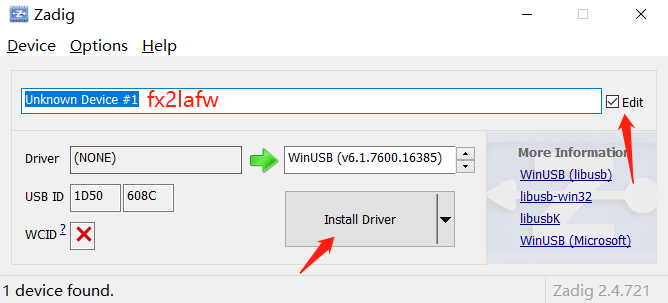

中文介绍见[WeActStudio博客](http://www.weact-tc.cn/2021/10/30/WeAct-LogicAnalyzerV1/)

中文介绍见[README_CN](./README_CN.md)

# WeAct LogicAnalyzer V1

WeAct LogicAnalyzerV1 is a logic analyzer designed based on Cypress `CY7C68013A` USB controller. It can collect 8 channels at the same time. The maximum sampling rate of each channel is `24Mhz`, and the maximum logical level supports 5.5V. The software adopts `sigrok-PulseView`, which is open source, and supports Linux, Windows, Mac OS X and other platforms. It supports more than 100 kinds of protocol analysis, and can add its own protocol analysis.

* Sampling rate and number of channels: 24Mhz@8 Channel
* Signal input range: 0-5.5V
* High and low level recognition range: VIH: >2V,VIL: <0.8V
* Communication mode: USB 2.0 (In order to ensure the sampling rate of 24Mhz, try not to use USB docking station)

# Begin to use
1. Download [sigrok-PulseView Software](https://sigrok.org/wiki/Downloads)
2. Install sigrok-PulseView && LogicAnalyzer driver
> After PulseView is installed, run Zadig, select the device you want to Install the Driver on, check Edit, change the device name to `fx2LAFw`, and then click `Install Driver`

3. Click PulseView to run the software, and the yellow light of the logic analyzer will light up,indicating that the firmware is loaded successfully and the logic signal can be sampled

# Supported protocols
See sigrok [Supported Protocol decoders](https://sigrok.org/wiki/Protocol_decoders)

# Q&A
1. Sampling is not up to 24Mhz
> Try to connect the logic analyzer to a separate USB port and do not use a USB docking station
2. Why does the acquisition of 10Mhz signal appear distortion
> The sampling rate of the general logic analyzer needs to be 3-5 times higher than the frequency of the sampled signal to avoid distortion
3. Why is no firmware provided
> Firmware is written online via PulseView, providing little meaning
4. Reprogram or not
> Support, their own use of programming, but EEPROM only 2Kbit size
5. Two leds indicate which two channels
> The green light indicates CH0 and the blue light indicates CH1
6. TBD