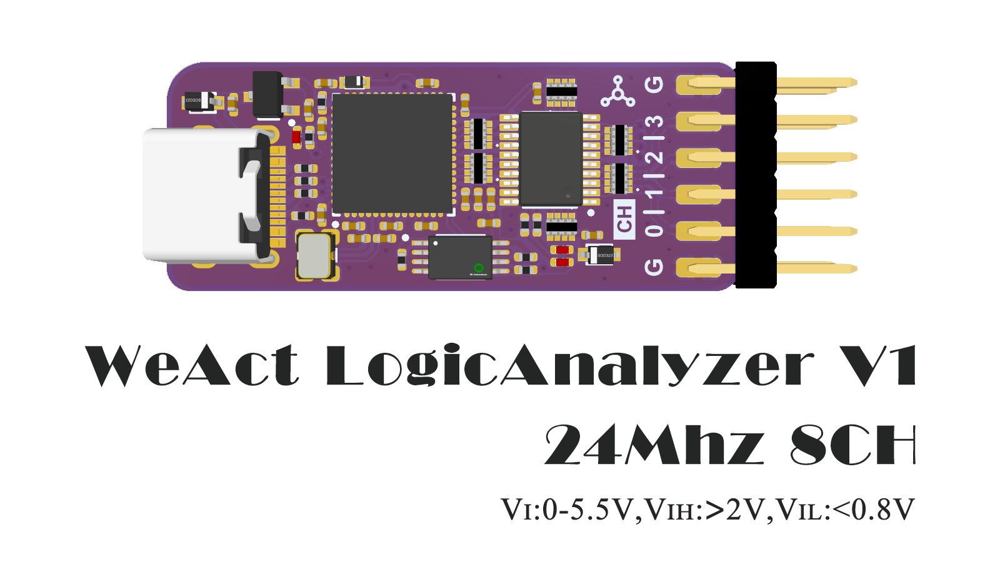
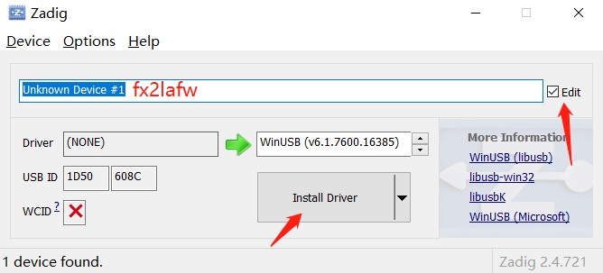
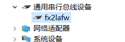
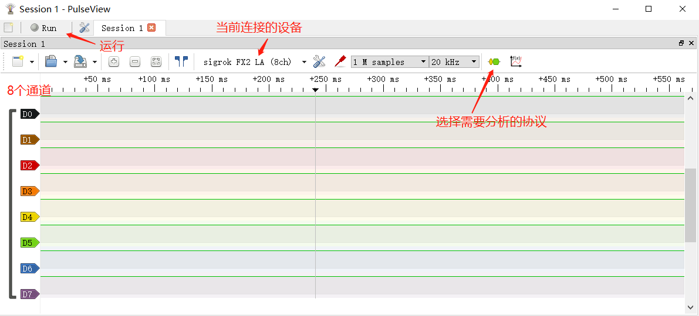

# 简介
WeAct LogicAnalyzerV1是一款基于 赛普拉斯CY7C68013A/芯佰微CBM9002A USB控制器设计的逻辑分析仪，可同时采集8个通道，每个通道最大采样率为24Mhz，逻辑电平最大支持5.5V，大于2V认为是高电平，低于0.8V认为是低电平。软件采用开源的sigrok-PulseView，支持Linux、Windows、Mac OS X等平台，协议解析支持超过100种，并且可以添加自有协议分析。
逻辑分析仪具体参数如下：
* 采样率及通道数：24Mhz@8 Channel
* 信号输入范围：0-5.5V
* 高低电平识别范围：VIH: >2V,VIL: <0.8V
* 通讯方式：USB 2.0 （为了保证24Mhz的采样率，尽量不要使用USB扩展坞）

# 开始使用
1. 下载sigrok-PulseView [官方稳定版本](https://sigrok.org/wiki/Downloads) （务必下载Release builds，0.4.2版本）
2. 下载并安装逻辑分析仪驱动
> 有两种安装驱动的方法
>* 第一种：使用PulseView自带的驱动，PulseView安装完后运行Zadig,选择需要安装驱动的设备，并勾选Edit，将设备名改为`fx2lafw`,然后点击`Install Driver`即可

>* 第二种：使用我们提供的驱动程序，[点我下载](https://www.weact-tc.cn/Download/fx2lafw_driver.zip)，解压，选择`fx2lafw.inf`文件，右键选择`安装`，系统会自动开始安装驱动程序，弹出`操作成功完成`，设备管理器显示如下设备，即为安装完成，测试平台——Win10

3. 点击PulseView运行软件，此时逻辑分析仪的黄灯会亮起，表示固件加载成功，可以采样逻辑信号。

# 支持的协议
见sigrok [Supported Protocol decoders](https://sigrok.org/wiki/Protocol_decoders)

# 常见问题
1. 采样达不到24Mhz
> 尝试将逻辑分析仪连接至独立USB端口，不要使用USB扩展坞
2. 为什么采集10Mhz的信号会出现失真
> 一般逻辑分析仪的采样率需要比被采样信号的频率高3~5倍才有可能不失真
3. 为什么没有固件提供
> 固件通过PulseView在线写入，提供意义不大
4. 是否重新编程
> 支持，自行使用编程器编程，但EEPROM只有2Kbit大小
5. 两个LED分别指示哪两个通道
> 绿灯指示CH0，蓝灯指示CH1
6. 提示msvcr100.dll找不到  
  
> 将msvcr100.dll（文件在Tools文件夹）放在 pulseview.exe所在的目录，如C:\Program Files (x86)\sigrok\PulseView\
7. TBD
